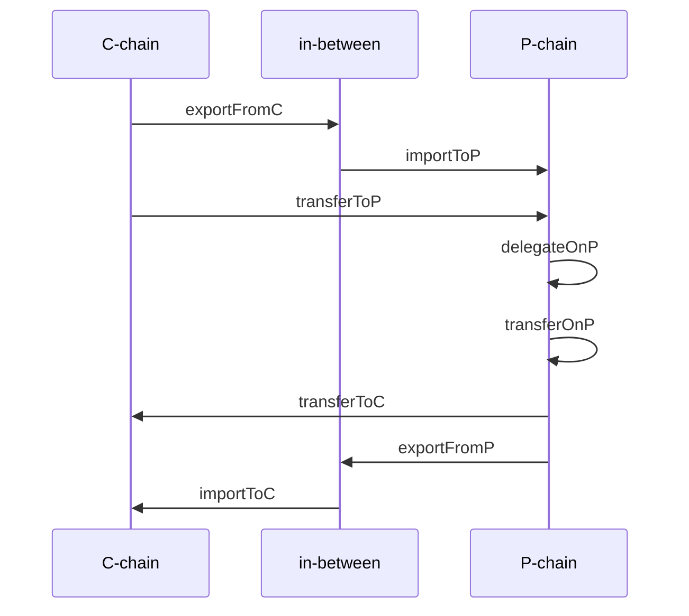

# Flare: Transaction SDK

This is the official Node.js Software Development Kit (SDK) for performing common actions on Flare's networks:

- [Retrieving account and balance information](#account-and-balance-1)
- [Transferring native and wrapped coins](#coin-transfers-1)
- [Claiming rewards from FlareDrop, staking, FTSO delegation and rNat projects](#reward-claims-1)
- [Delegating to FTSO providers](#delegation-to-ftso-providers-1)
- [Voting on Flare foundation proposals](#voting-on-flare-foundation-proposals)
- [Interacting with C-chain contracts](#c-chain-contracts-1)
- [Creating and using smart (multisig) accounts](#smart-account)
- [Staking on the P-chain](#staking-1)

The SDK is designed to simplify blockchain interactions and offer future-proof support for the above described actions, making it easier to develop apps on [Flare's networks](#network-object). It can be integrated with both [standard and custom wallets](#wallet-implementation) for transaction signing, and provides detailed, step-by-step [transaction tracking](#transaction-tracking).

## Quick start

To install the library in a Node.js project, run
```
npm install @flarenetwork/flare-tx-sdk
```

The following is a brief overview of the available actions. Suppose
- `network` is an object of class [`Network`](src/network/network.ts), e.g. `Network.FLARE`
- `wallet` is an object of a suitable class that [implements](#wallet-implementation) the interface [`Wallet`](src/wallet/wallet.ts)

### Account and balance

Deriving addresses from the wallet's public key:
```
let publicKey = await wallet.getPublicKey()
let cAddress = network.getCAddress(publicKey)
let pAddress = network.getPAddress(publicKey)
```

Overview of the wallet's balance:
```
let balance = await network.getBalance(publicKey)
```

### Coin transfers

Transferring native and wrapped native coin:
```
await network.transferNative(wallet, Amount.nats(1))
await network.transferWrapped(wallet, Amount.wnats(1))
```

Wrapping and unwrapping:
```
await network.wrapNative(wallet, Amount.nats(1))
await network.unwrapToNative(wallet, Amount.wnats(1))
```

### Reward claims

Claiming reward from FlareDrop:
```
let amount = await network.getClaimableFlareDropReward(cAddress)
await network.claimFlareDropReward(wallet)
```

Claiming reward from staking:
```
let amount = await network.getClaimableStakingReward(cAddress)
await network.claimStakingReward(wallet)
```

Claiming reward from FTSO delegation:
```
let amount = await network.getClaimableFtsoReward(cAddress)
await network.claimFtsoReward(wallet)
```

Claiming reward from a rNat project and withdrawing from rNat account:
```
let amount = await network.getClaimableRNatReward(projectId, cAddress)
await network.claimRNatReward(wallet, [projectId])

let amount = await network.getUnlockedBalanceWrappedOnRNatAccount(cAddress)
await network.withdrawFromRNatAccount(wallet)
```

### Delegation to FTSO providers

Delegating:
```
let share = Amount.percentages(50)
await network.delegateToFtso(wallet, address1, share, address2, share)
```

Delegation information:
```
let delegates = await network.getFtsoDelegatesOf(cAddress)
```

### C-chain contracts

Calling contract methods:
```
let result = await network.invokeContractCallOnC(address, abi, method, params)
```

Executing contract methods:
```
await network.invokeContractMethodOnC(wallet, address, abi, method, value, params)
```

### Staking

Delegating on the P-chain:
```
await network.delegateOnP(wallet, amount, nodeId, startTime, endTime)
```

Transferring funds back to the C-chain when the delegation ends:
```
await network.transferToC(wallet)
```

## Wallet implementation

In order to generate and sign transactions on the C-chain and P-chain, a suitable implementation of the interface [`Wallet`](src/wallet/wallet.ts) must be provided. Each object implementing the interface should be associated with a unique signing key.

The SDK provides proxies to facilitate the integration of standard wallets, such as Web3 based wallets (EIP-1193 standard), Ledger, and Trezor. Details are specified in [Standard wallets](#standard-wallets).

In general, for transaction generation, the wallet should implement the function
```
getPublicKey(): Promise<string>
```
that returns the public key of the wallet in the hexadecimal encoding. This function is required for P-chain related operations. For generating C-chain transaction only, it is sufficient that the wallet implements the function
```
getCAddress(): Promise<string>
```
that returns the C-chain address in the hexadecimal encoding. This function is not required if the function `getPublicKey` is available.

Moreover, in order to execute transactions, the wallet should implement one or more functions for signing. The documentation of each SDK function that receives the `Wallet` object provides information which of the following functions are suitable to execute the actions.

The functions that can be used for signing are the following.

- The function for signing a C-chain (EVM) transaction (recommended for C-chain related operations):
    ```
    signCTransaction(tx: string): Promise<string>
    ```
    The input `tx` is a hex encoded EIP 1559 (type 2) EVM transaction.

- The function for signing a P-chain transaction (recommended for P-chain related operations):
    ```
    signPTransaction(tx: string): Promise<string>
    ```
    The input `tx` is a hex encoded P-chain transaction.

- The function for signing the digest of a message (generally applicable):
    ```
    signDigest(digest: string): Promise<string>
    ```
    The input `digest` is a hex encoded digest of a hash function.

- The function for signing a message with ETH prefix (applicable for P-chain operations):
    ```
    signEthMessage(message: string): Promise<string>
    ```
    The input `message` is a UTF8 string.

Each of the above functions should return the signature in hexadecimal encoding.

Alternatively, for C-chain related operations, when signing and submitting of a C-chain (EVM) transaction are inseparable, the wallet can implement the function
```
signAndSubmitCTransaction(tx: string): Promise<string>
```
The input `tx` is a hex encoded EIP 1559 (type 2) EVM transaction. If the wallet implements this function, it is considered as the default function for signing C-chain transactions. The function should return the transaction id in hexadecimal encoding.

A wallet can also be marked to act as an operation signer in a multisig process based on a [Safe smart account](#smart-account). This is achieved by defining the property `smartAccount` of type `string` and setting it to be equal to the C-chain address of a Safe smart account, in which the wallet's C-chain address represents an owner. When the property is different from `undefined`, all the C-chain operations supported by the SDK produce transactions that induce either approval or execution of these operations on the smart account.

## Network object

The queries and actions on the network are executed using the [`Network`](src/network/index.ts) object.
- The Flare network:
    ```
    let network = Network.FLARE
    ```
- The Songbird network:
    ```
    let network = Network.SONGBIRD
    ```
- The Coston network (test network for Songbird):
    ```
    let network = Network.COSTON
    ```
- The Coston2 network (test network for Flare):
    ```
    let network = Network.COSTON2
    ```
- For a custom network or a `Network` object with custom settings, first create a suitable [`Constants`](src/network/constants.ts) object `constants` and then use:
    ```
    let network = new Network(constants)
    ```

## Transaction tracking

To track the process of signing and submitting of transactions to the network, the following [callbacks](src/network/callback.ts) can be registered with a `Network` object.

The first three callbacks return a `Boolean` and can be used to stop the transaction execution, e.g. if the tool is used only for transaction generation for offline signing. Note, however, that certain processes consist of several consecutive transactions that may depend on each other, and stopping a transaction may result in the failure of subsequent actions.

### Before transaction signature

If set, the function of type `BeforeTxSignatureCallback` is called prior to each signature request on the wallet object. To set the callback, use
```
network.setBeforeTxSignatureCallback(async (data: BeforeTxSignature) => { return true })
```
The object of type `BeforeTxSignature` contains the properties:
- `txType` the [code](src/network/txtype.ts) of the transaction type;
- `unsignedTxHex` the unsigned transaction in the hexadecimal encoding.

The property `unsignedTxHex` can be used for transaction verification (see e.g. [Flare: Transaction verification library](https://github.com/flare-foundation/flare-tx-verifier-lib)).

Normally, the callback should return `true`, which grants permission to invoke the signature request on the wallet object. If it returns `false`, the transaction is not signed and submitted to the network.

### Before transaction submission

If set, the function of type `BeforeTxSubmissionCallback` is called prior to the submission of each transaction. To set the callback, use
```
network.setBeforeTxSubmissionCallback(async (data: BeforeTxSubmission) => { return true })
```
The object of type `BeforeTxSubmission` contains the properties:
- `txType` the [code](src/network/txtype.ts) of the transaction type;
- `signedTxHex` the signed transaction in the hexadecimal encoding;
- `txId` the id of the signed transaction in the hexadecimal encoding.

Normally, the callback should return `true`, which grants the permission to submit the transaction to the network. If it returns `false`, the transaction is not submitted.

When the function `signAndSubmitCTransaction` is used as the wallet's signing function, this callback is not executed.

### After transaction submission

If set, the function of type `AfterTxSubmissionCallback` is called immediately after the submission of each transaction to the network. To set the callback, use
```
network.setAfterTxSubmissionCallback(async (data: AfterTxSubmission) => { return true })
```
The object of type `AfterTxSubmission` contains the properties:
- `txType` the [code](src/network/txtype.ts) of the transaction type;
- `txId` the id of the submitted transaction in the hexadecimal encoding.

Normally, the callback should return `true`, which signals that the confirmation of the transaction on the network is to be awaited before proceeding. If it returns `false`, the confirmation is not awaited.

### After transaction confirmation

If set, the function of type `AfterTxConfirmationCallback` is called immediately after the confirmation of each transaction to the network. To set the callback, use
```
network.setAfterTxConfirmationCallback(async (data: AfterTxConfirmation) => { // use data })
```
The object of type `AfterTxConfirmation` contains the properties:
- `txType` the [code](src/network/txtype.ts) of the transaction type;
- `txId` the id of the submitted transaction in the hexadecimal encoding;
- `txStatus` the status of the transaction: true if accepted and false if rejected.

## Background

### Account and balance

The network uses two different chains for performing operations. Most of the operations are executed on the standard EVM chain, which is called the C-chain (contract chain). The chain for staking is called the P-chain.

The address of a given wallet on the C-chain differs from the address of the same wallet on the P-chain, but both addresses are derived from the same public key. Therefore, the wallet implementation must enable public key retrieval, from which the associated C-chain and P-chain addresses are derived. For a given `wallet`, they can be obtained by
```
let publicKey = await wallet.getPublicKey()
let cAddress = network.getCAddress(publicKey)
let pAddress = network.getPAddress(publicKey)
```

The information on wallet balance can be obtained by
```
let balance = await network.getBalance(publicKey)
```
The resulting object `balance` is of type [`Balance`](src/network/iotype.ts) and has the following properties:
- `availableOnC` The balance available on the C-chain;
- `availableOnP` The balance available on the P-chain;
- `wrappedOnC` The balance wrapped on the C-chain
- `stakedOnP` The balance staked on the P-chain;
- `notImportedToC` The balance exported from the P-chain but not imported to the C-chain;
- `notImportedToP` The balance exported from the C-chain but not imported to the P-chain.

Here and hereafter, all monetary amounts are considered in the Wei units and represented as `BigInt`.

Separately, the balance information can be obtained by
```
await network.getBalanceOnC(publicKeyOrCAddress)
```
```
await network.getBalanceWrappedOnC(publicKeyOrCAddress)
```
```
await network.getBalanceOnP(publicKey)
```
```
await network.getBalanceNotImportedToC(publicKey)
```
```
await network.getBalanceNotImportedToP(publicKey)
```
```
await network.getBalanceStakedOnP(publicKey)
```

### Coin transfers

The native coin of the C-chain can be transferred using
```
await network.transferNative(wallet, recipient, amount)
```
to the C-chain address specified by `recipient`. To transfer the entire native coin balance, use
```
await network.transferAllNative(wallet, recipient)
```

The native coin on the C-chain can be wrapped to an ERC20 token WNat, which represents the wrapped native token. The exchange is in ratio 1:1 and can be performed by
```
await network.wrapNative(wallet, amount)
```

The wrapped coin can be exchanged back to the native coin by calling
```
await network.unwrapToNative(wallet, amount)
```

The wrapped coin can be transferred by the ERC20 standard using
```
await network.transferWrapped(wallet, amount)
```

### Reward claims

There are different types of rewards that can be claimed in the Flare's network.

#### FlareDrop rewards

FlareDrop is a distribution method for the remaining unreleased FLR tokens after the original airdrop. It is distributed monthly to those that wrap their FLR tokens.

The amount of claimable reward for a given public key or C-chain address `publicKeyOrAddress` can be obtained by
```
let amount = await network.getClaimableFlareDropReward(publicKeyOrAddress)
```
To claim all claimable reward, use
```
await network.claimFlareDropReward(wallet, rewardOwner, recipient, wrap)
```
The only required input parameter is `wallet`. The parameter `rewardOwner` is the C-chain address of the reward owner and can be omitted if it is equal to the wallet's C-chain address. Similarly, `recipient` can be omitted if the reward is to be transferred to the wallet's C-chain address. The parameter `wrap` indicates if the reward is to be transferred to `recipient` as native coin (default) or as wrapped coin.

#### Staking rewards

[Staking on the P-chain](#staking-1) yields staking rewards on the C-chain.

The amount of claimable reward for a given public key or C-chain address `publicKeyOrAddress` can be obtained by
```
let amount = await network.getClaimableStakingReward(publicKeyOrAddress)
```
To claim all claimable reward, use
```
await network.claimStakingReward(wallet, rewardOwner, recipient, wrap)
```
The only required input parameter is `wallet`. The parameter `rewardOwner` is the C-chain address of the reward owner and can be omitted if it is equal to the wallet's C-chain address. Similarly, `recipient` can be omitted if the reward is to be transferred to the wallet's C-chain address. The parameter `wrap` indicates if the reward is to be transferred to `recipient` as native coin (default) or as wrapped coin.

#### FTSO delegation rewards

Running an FTSO provider, [delegation to FTSO providers](#delegation-to-ftso-providers-1), or even just staking yields FTSO rewards.

The amount of claimable reward for a given public key or C-chain address `publicKeyOrAddress` can be obtained by
```
let amount = await network.getClaimableFTSOReward(publicKeyOrAddress)
```
To claim all claimable weight based reward (i.e. reward resulting in delegation to FTSO providers and staking), use
```
await network.claimFtsoReward(wallet, rewardOwner, recipient, wrap)
```
The only required input parameter is `wallet`. The parameter `rewardOwner` is the C-chain address of the reward owner and can be omitted if it is equal to the wallet's C-chain address. Similarly, `recipient` can be omitted if the reward is to be transferred to the wallet's C-chain address. The parameter `wrap` indicates if the reward is to be transferred to `recipient` as native coin (default) or as wrapped coin.

To get a more detailed overview of the reward state, use
```
let states = await network.getStateOfFtsoRewards(publicKeyOrAddress)
```
The resulting object `states` is an array of array states. An array state is an array of claimable rewards for a specific reward epoch. It can be empty or it consists of objects of type [`FtsoRewardState`](src/network/iotype.ts) with properties:
- `rewardEpochId` The reward epoch id;
- `beneficiary` The reward owner (C-chain address or node id if `claimType` is `MIRROR`);
- `amount` The reward amount in weis;
- `claimType` The type of claim;
- `initialised` The flag indicating if the reward can be claimed without providing proofs.

The rewards that are not initialised can be claimed using Merkle proofs available in [Flare System Protocol Reward Distribution repository](https://github.com/flare-foundation/fsp-rewards/) by
```
await network.claimFtsoReward(wallet, rewardOwner, recipient, wrap, proofs)
```
where `proofs` is an array of objects of type [`FtsoRewardClaimWithProof`](src/network/iotype.ts) with properties:
- `merkleProof` The Merkle proof represented by an array of strings in hexadecimal encoding;
- `body` The reward claim represented as an object of type [`FtsoRewardClaim`](src/network/iotype.ts) with the same properties as `FtsoRewardState` described above (except `initialised`).

#### rNat rewards

Participation in Flare's networks rNat projects yields rewards in the form of rNat tokens. On claiming, rNat tokens are backed up by wrapped coins deposited to the owner's unique rNat account, where they are vested. The owner can eventually withdraw the wrapped coins from the rNat account to its own account.

The list of all rNat projects can be obtained by
```
let projects = await network.getRNatProjects()
```
which returns an array of objects of type [`RNatProject`](src/network/iotype.ts) with properties:
- `id` The project id;
- `name` The name of the project;
- `claimingDisabled` The flag indicating if claiming of the rewards on the project is disabled.
To get more detailed information on a particular project, use
```
let projectInfo = await network.getRNatProjectInfo(projectId)
```
The resulting object `projectInfo` is of type [`RNatProjectInfo`](src/network/iotype.ts) with properties:
- `name` The project name;
- `distributor` The address of the distributor of the rewards for the project;
- `currentMonthDistributionEnabled` The flag indicating if reward distribution is possible for the current month;
- `distributionDisabled` The flag indicating if distribution of the rewards is disabled;
- `claimingDisabled` The flag indicating if claiming of rewards is disabled;
- `totalAssignedRewards` The total amount of rewards in wei awarded by Flare's networks for this project;
- `totalDistributedRewards` The total amount of assigned rewards in wei distributed by the distributor;
- `totalClaimedRewards` The total amount of the distributed rewards in wei claimed by the users;
- `totalUnassignedUnclaimedRewards` The total amount of rewards in wei that are claimed back by Flare's networks if distribution and claiming is permanently disabled for the project;
- `monthsWithRewards` The array of months with claimable rewards.

The amount of claimable reward for a given project with `projectId` and a user participating in the project identified by a given public key or C-chain address `publicKeyOrAddress` can be obtained by
```
let amount = await network.getClaimableRNatReward(projectId, publicKeyOrAddress)
```
To claim all claimable rNat rewards, use
```
await network.claimRNatReward(wallet, projectIds)
```
where `projectIds` is an array of project ids for which the reward is being claimed. The claimed rewards are deposited as wrapped coins to the dedicated rNat account, which is associated with the wallet's C-chain address (rNat account owner).

The wrapped coins on the rNat account are vested. To get the amount of unlocked wrapped coins, use
```
let unlockedBalance = await network.getUnlockedBalanceWrappedOnRNatAccount(publicKeyOrAddress)
```
where `publicKeyOrAddress` is the public key or C-chain address of the rNat account owner. The amount of locked wrapped coins can be obtained by
```
let lockedBalance = await network.getLockedBalanceWrappedOnRNatAccount(publicKeyOrAddress)
```
Full information on the rNat account balance can be obtained by
```
let balance = await network.getRNatAccountBalance(publicKeyOrAddress)
```
The resulting object `balance` is of type [`RNatAccountBalance`](src/network/iotype.ts) with properties:
- `wNatBalance` The balance of wrapped coins in wei;
- `rNatBalance` The balance of rNat tokens in wei;
- `lockedBalance` The balance of locked wrapped coins in wei.

The amount of rNat tokens equals the difference between received and withdrawn rNat rewards. The amount of wrapped coins on an rNat account can be larger than the amount of rNat tokens.

For example, the amount of wrapped coins can be increased by [claiming the FlareDrop reward](#flaredrop-rewards) accrued from (vested) wrapped coins on the rNat account. To check the amount of unclaimed FlareDrop reward for the rNat account owned by `publicKeyOrAddress`, use
```
let rNatAccountAddress = await network.getRNatAccount(publicKeyOrAddress)
let amount = await network.getClaimableFlareDropReward(rNatAccountAddress)
```
To claim the reward, use
```
await network.claimFlareDropReward(wallet, rNatAccountAddress, rNatAccountAddress, true)
```
where `rNatAccountAddress` is the C-chain address of the rNat account associated with the C-chain address of `wallet`. This operation transfers all claimable FlareDrop reward to the rNat account and increases its balance of wrapped coins.

Finally, to withdraw funds from the rNat account, use
```
await network.withdrawFromRNatAccount(wallet, amount, wrap)
```
where `amount` is the amount of unlocked wrapped coins to withdraw and `wrap` is a flag indicating if the `amount` is to be transferred as native coin (`false`) or wrapped (`true`). Both, `amount` and `wrap` are optional parameters. By default, `amount` is equal to the amount of all unlocked wrapped balance and `wrap` is equal to `false`.

It is also possible to withdraw all funds from the rNat account, including locked and unlocked balance. To achieve this, use
```
await network.withdrawAllFromRNatAccount(wallet, wrap)
```
but note that the actual withdrawn amount is reduced as a penalty to withdrawing locked balance. The flag `wrap` is again optional and is by default equal to `false`.


### Delegation to FTSO providers

The account's vote power corresponding to the balance of the wrapped tokens can be delegated to one or two FTSO providers to earn delegation reward. The amount of delegated vote power is specified in percentages. The vote power can be delegated to one or two FTSO providers.

The status of current delegations can be obtained by
```
let delegations = await network.getFtsoDelegatesOf(publicKey)
```
The result is an array of objects of type [`FtsoDelegate`](src/network/iotype.ts) with properties:
- `address` The C-chain address of the delegate;
- `shareBP` The delegation share in base points.

The shares are expressed in the base point units, a unit corresponds to 0.01%.

To delegate vote power to one provider, use
```
await network.delegateToFtso(wallet, providerAddress, shareBP)
```
To delegate vote power to two providers, use
```
await network.delegateToFtso(wallet, provider1Address, share1BP, provider2Address, share2BP)
```
The sum of `share1BP` and `share2BP` should be less than 10000, i.e., 100%.

To undelegate all vote power, use
```
await network.undelegateFromFtso(wallet)
```

### Voting on Flare Foundation proposals

Participants in the Flare's networks can vote on proposals issued by the Flare Foundation organization. The governance vote power depends on the amount of wrapped coins and the staking amount of the voter at a particular block related to the proposal (vote power block). A voter can also decide to delegate all the vote power to a different voter.

To obtain Flare Foundation proposals, use
```
let proposalIds = await network.getFoundationProposalIds()
```
which returns an array of proposal ids. Note that this includes recent proposals, but it is not a complete list of all historical proposals. To obtain detailed information about a proposal with id `proposalId`, use
```
let proposalInfo = await network.getFoundationProposalInfo(proposalId)
```
which returns an object of type [`FoundationProposalInfo`](src/network/iotype.ts) with properties:
- `description` The description of the proposal;
- `state` The state of the proposal:
    - `FoundationProposalState.PENDING` (`0`) The voting has not yet started;
    - `FoundationProposalState.ACTIVE` (`1`) The voting is in process;
    - `FoundationProposalState.DEFEATED` (`2`) The proposal has been unsuccessful;
    - `FoundationProposalState.SUCCEEDED` (`3`) The proposal has been successful;
    - `FoundationProposalState.QUEUED` (`4`) The proposal is queued for execution;
    - `FoundationProposalState.EXPIRED` (`5`) The proposal has expired before it has been executed;
    - `FoundationProposalState.EXECUTED` (`6`) The proposal has been executed;
    - `FoundationProposalState.CANCELED` (`7`) The proposal has been canceled;
- `votePowerFor` The accumulated vote power for the proposal.
- `votePowerAgainst` The accumulated vote power against the proposal.
- `proposer` The address of the proposal submitter.
- `accept` A flag indicating if the proposal is of acceptance type (`true`), i.e., a certain amount of vote power for the proposal must be accumulated for the proposal to be accepted, or rejection type (`false`), i.e., a certain amount of vote power against the proposal must be accumulated for the proposal to be rejected;
- `votePowerBlock` The block number used to determine the vote powers in voting process;
- `voteStartTime` The start time (in Unix time) of the proposal voting;
- `voteEndTime` The end time (in Unix time) of the proposal voting;
- `thresholdConditionBP` The percentage in base points of the total vote power required for the proposal "quorum";
- `majorityConditionBP` The percentage in base points of the proper relation between FOR and AGAINST votes;
- `circulatingSupply` The circulating supply at vote power block.

A vote for a proposal with id `proposalId` can be cast when the state of the proposal is `ACTIVE`. To check if a voter identified by `publicKeyOrAddress` has cast a vote, use
```
await network.hasCastVoteForFoundationProposal(publicKeyOrAddress, proposalId)
```
A vote can be cast by
```
await network.castVoteForFoundationProposal(wallet, proposalId, support)
```
where support is either `FoundationProposalSupport.AGAINST` (`0`) or `FoundationProposalSupport.FOR` (`1`).

The governance vote power can be delegated to a different voter identified by the C-chain address `delegate` by
```
await network.delegateGovernanceVotePower(wallet, delegate)
```
and undelegated by
```
await network.undelegateGovernanceVotePower(wallet)
```

To check the current governance vote power of a voter identified by `publicKeyOrAddress`, use
```
let votePower = await network.getCurrentGovernanceVotePower(publicKeyOrAddress)
```
where the resulting `votePower` is the sum of the voter's own vote power and the vote power that is currently delegated to the voter. To obtain the current vote delegate for a given `publicKeyOrAddress`, use
```
let delegate = await network.getCurrentGovernanceVoteDelegate(publicKeyOrAddress)
```
If `delegate` is zero address, this indicates that there is no delegate. If `delegate` is not zero address, the vote power of the delegator is zero.

It is also possible to obtain the vote power and the delegate of a given account identified by `publicKeyOrAddress` as it has been effective in the voting for a particular proposal with id `proposalId`. In that case, use
 ```
let vote power = await network.getVotePowerForFoundationProposal(publicKeyOrAddress, proposalId)
let delegate = await network.getVoteDelegateForFoundationProposal(publicKeyOrAddress, proposalId)
 ```
Note, however, that this query may fail for not so recent proposals as old governance vote power data is being regularly deleted from the C-chain storage.

### C-chain contracts

The C-chain is a standard EVM blockchain populated by the official Flare contracts, as well as other contracts deployed by the community. To interact with any of these contracts, it is sufficient to know the contract `address` and its application binary interface `abi`.

To call a contract method with the name `method` with the purpose of obtaining information from the contract, use
```
let result = await network.invokeContractCallOnC(address, abi, method, params)
```
where `params` is a sequence of parameters that the method accepts as inputs.

Similarly, to invoke a transaction method, use
```
await network.invokeContractMethodOnC(wallet, address, abi, method, value, params)
```
where `value` is the amount of native tokens to send in transaction when the calling method is marked as `payable`.

For the official Flare contracts, the input `address` can be replaced by the contract's name. The list of these contracts is returned by
```
await network.getFlareContracts()
```

### Smart account

A Safe smart account is a smart contract on the C-chain operated by selected owners. The smart account can be used to execute standard operations on the C-chain provided that the actions are approved by a sufficient number of owners (smart account threshold).

A new smart account can be created by
```
let smartAccountAddress = await network.createSafeSmartAccount(wallet, owners, threshold)
```
where `owners` is an array of C-chain addresses in hexadecimal encoding representing the owners of the smart account, and `threshold` is an integer between 1 and the length of `owners` representing the smart account threshold. If the wallet's C-chain address is not included in `owners`, the wallet's account is only the creator of the smart account and does not participate in its operation. The result `smartAccountAddress` is the C-chain address of the smart account in hexadecimal encoding.

A smart account can be used in any C-chain operation supported by this SDK. To demosntrate the concept and basic workflow, the following example shows how this functionality can be used to wrap a certain `amount` of native coins on a smart account and how to transfer these wrapped coins from the smart account to a certain `address`.

First, let us deposit funds to the smart account:
```
await network.transferNative(wallet, smartAccountAddress, amount)
```
Suppose the smart account has 3 or more owners and threshold equal to 3. Moreover, let `wallet1`, `wallet2`, `wallet3` be three wallets that represent three different owners. To make them operate with the smart account, the owners set
```
wallet1.smartAccount = smartAccountAddress
wallet2.smartAccount = smartAccountAddress
wallet3.smartAccount = smartAccountAddress
```
To wrap native coins on the smart account, the owners execute
```
await network.wrapNative(wallet1, amount)
await network.wrapNative(wallet2, amount)
await network.wrapNative(wallet3, amount)
```
All three calls induce a transaction to the smart account. In the first two calls this is a transaction with which two owners approve the wrapping. In the third call this is a transaction with which another owner approves and also executes the operation, i.e., the balance of wrapped coins on the smart account has been increased by `amount`. Note that it is important that all three calls have identical inputs and no other operation on the same smart account interrupt the sequence of their execution.

Finally, the three owners agree to transfer wrapped coins from the smart account to `address`, which is achieved similarly as above by
```
await network.transferWrapped(wallet1, address, amount)
await network.transferWrapped(wallet2, address, amount)
await network.transferWrapped(wallet3, address, amount)
```

To use the wallets in a regular way again, the relation to the smart account must be cleared:
```
wallet1.smartAccount = undefined
wallet2.smartAccount = undefined
wallet3.smartAccount = undefined
```

### Staking

For staking, the network uses the P-chain and the information about stakes is then automatically mirrored to the C-chain.

In order to stake funds, one must delegate funds to a validator on the P-chain. This means that first a suitable amount of funds must be transferred from one's address on the C-chain to the one's address on the P-chain. After the delegation is complete, one can transfer the funds back from the P-chain to the C-chain.



#### Transferring funds from the C-chain to the P-chain

The process of transferring funds from the C-chain to the P-chain consists of two transactions: export from the C-chain and import to the P-chain. The call
```
await network.transferToP(wallet, amount)
```
first generates an export transaction that exports `amount + importFeeOnP` from the C-chain address and spends a certain `exportFeeOnC`. After the export transaction is signed, submitted and confirmed, an import transaction is generated that imports `amount` to the P-chain address and spends `importFeeOnP`. After the import transaction is signed, submitted and confirmed, the call is complete. The balance on the C-chain address is reduced by `amount + exportFeeOnC + importFeeOnP` and the balance on the P-chain address is increased by `amount`.

Note that the values appearing in the export and import transactions invoked by `transferToP` may differ from the described above if a certain `valueNotImportedToP` had previously not been imported to the P-chain due to the import transaction failure. The export transaction then exports `amount + importFeeOnP - valueNotImportedToP` from the C-chain address or is skipped if this export value is not positive. The import transaction imports `max(amount, valueNotImportedToP)` to the P-chain address and the balance of funds not imported to the P-chain becomes zero.

The value of `exportFeeOnC` is computed as the product of the `baseTxFeeOnC` and the size of the export transaction. The current value of the `baseTxFeeOnC` can be obtained by calling `await network.getBaseTxFeeOnC()`. The value of `importFeeOnP` is fixed and can be obtained by calling `network.getDefaultTxFeeOnP()`.

The export and import can be executed by individual calls as well, in order to have a separate call for each transaction. To export `amount` from the C-chain, use
```
await network.exportFromC(wallet, amount, baseTxFeeOnC)
```
The parameter `baseFeeTxOnC` is optional and can be used to override the automatically acquired base transaction fee from the C-chain. To import all exported funds from the C-chain to the P-chain, use
```
await network.importToP(wallet)
```

#### Delegation on the P-chain

The delegation on the P-chain can be executed by
```
await network.delegateOnP(wallet, amount, nodeId, startTime, endTime)
```
where `amount` is the amount to delegate, `nodeId` is the validator code of the form `NodeID-...`, and `startTime` and `endTime` are times given by the number of seconds from the Unix epoch. A delegation transaction is invoked. After the transaction is signed, submitted and confirmed, the balance on the P-chain address is reduced by `amount` and the staked balance on P is increased by `amount`. The transaction is without fee. After the delegation is complete, the staked amount is returned to the P-chain address.

If the provided `amount` is greater than `availableOnP` at the time of the call, the function attempts to transfer `amount - availableOnP` from the C-chain to the P-chain. Therefore, in such cases, the above call also invokes the export and import transactions as described in the previous section.

#### Transferring funds from the P-chain to the C-chain

The process of transferring funds from the P-chain to the C-chain consists of two transactions: export from the P-chain and import to the C-chain. The call
```
await network.transferToC(wallet, amount)
```
first generates an export transaction that exports `amount` from the P-chain address and spends a fixed `exportFeeOnP`. After the export transaction is signed, submitted and confirmed, an import transaction is generated that imports `amount - importFeeOnC` to the C-chain address and spends a certain `importFeeOnC`. After the import transaction is signed, submitted and confirmed, the call is complete. The balance on the P-chain address is reduced by `amount + exportFeeOnP` and the balance on the C-chain address is increased by `amount - importFeeOnC`. In that sense the function `transferToC` is not symmetric to the function `transferToP` as the `importFee` is difficult to predict in advance.

As a shorthand to transfer the entire balance from the P-chain address to the C-chain address, the `amount` parameter in the above call can be omitted, i.e., the call
```
await network.transferToC(wallet)
```
is equivalent to the above with `amount = balanceOnP - exportFeeOnP`.

Note that the values appearing in the export and import transactions invoked by `transferToC` may differ from the described above if a certain `valueNotImportedToC` had previously not been imported to the C-chain due to the import transaction failure. The export transaction then exports `amount - valueNotImportedToC` from the P-chain address or is skipped if this export value is not positive. The import transaction imports `max(amount, valueNotImportedToC) - exportFeeOnP` to the P-chain address and the balance of funds not imported to the P-chain becomes zero.

The value of `exportFeeOnP` is fixed and can be obtained by calling `network.getDefaultTxFeeOnP()`. The value of `importFeeOnC` is computed as the product of the `baseTxFeeOnC` and the size of the export transaction. The current value of the `baseTxFeeOnC` can be obtained by calling `await network.getBaseTxFeeOnC()`.

The export and import can be executed by individual calls as well, in order to have a separate call for each transaction. To export `amount` from the P-chain, use
```
await network.exportFromP(wallet, amount)
```
To import all exported funds from the P-chain to the C-chain, use
```
await network.importToP(wallet, baseTxFeeOnC)
```
The parameter `baseFeeTxOnC` is optional and can be used to override the automatically acquired base transaction fee from the C-chain.

### Transferring funds on the P-chain

It is also possible to transfer funds between addresses on the P-chain. Use
```
await network.transferOnP(wallet, recipient, amount)
```
where `recipient` is the recipient P-chain address in bech32 encoding and `amount` is the amount in weis to be transferred. If `amount` is not provided, the entire wallet's P-chain balance is transferred.


## Standard wallets

As explained in [Wallet implementation](#wallet-implementation), for generating and signing transactions using this SDK, an implementation of the interface [`Wallet`](src/wallet/wallet.ts) is required. The following describes SDK-compatible wallet implementations that are available in SDK and can be used in combination with standard wallet frameworks and libraries.

### EIP-1193 based wallets

The [EIP-1193 standard](https://eips.ethereum.org/EIPS/eip-1193) specifies an API for signing and submitting EVM transactions. This standard is followed by common Web3 wallets such as MetaMask, WalletConnect, Coinbase Wallet, etc. The crucial ingredient of these wallets is the EIP-1193 provider object.

To setup SDK-compatible wallets that communicate with the EIP-1193 provider, first extract `provider` object from the Web3 wallet framework, and then use
```
let controller = new EIP1193WalletController(provider)
```
to instantiate [`EIP1193WalletController`](./src/wallet/eip1193/controller.ts) for managing SDK-compatible wallets. In particular, use
```
let wallet = await controller.getActiveWallet()
```
to obtain the SDK-compatible wallet associated with the currently active account in the Web3 wallet framework, and
```
let wallets = await controller.getWallets()
```
to obtain a list of the SDK-compatible wallets that correspond to all available accounts. In a Web3 wallet framework, a user can dynamically change the active account. To be notified of this, assign a listener to `controller`:
```
controller.onWalletChange((wallet: EIP1193Wallet) => { // use changed wallet })
```

The class [`EIP1193Wallet`](./src/wallet/eip1193/wallet.ts) implements the following functions that enable generating and signing of all types of C-chain and P-chain transactions.

- `getCAddress`
- `getPublicKey`
- `signEthMessage`
- `signAndSubmitCTransaction`

### Ledger wallet

For signing on a Ledger device, an SDK-compatible wallet can be obtained by using [@zondax/ledger-flare](https://www.npmjs.com/package/@zondax/ledger-flare), the official Zondax Ledger client library for the Flare's networks, or [@ledgerhq/hw-app-eth](https://www.npmjs.com/package/@ledgerhq/hw-app-eth), the standard Ledger client library for the Ethereum network.

First, setup `flrApp` (an instance of [`FlareApp`](https://github.com/Zondax/ledger-flare-js/blob/main/src/index.ts) to be used for signing with Flare app on Ledger device or `null`) and `ethApp` (an instance of [`Eth`](https://github.com/LedgerHQ/ledger-live/blob/develop/libs/ledgerjs/packages/hw-app-eth/src/Eth.ts) to be used for signing with Ethereum app on Ledger device or `null`). Then, instantiate [`LedgerWalletController`](./src/wallet/ledger/controller.ts):
```
let controller = new LedgerWalletController(flrApp, ethApp)
```
To obtain a SDK-compatible wallet, provide a [BIP-44](https://github.com/bitcoin/bips/blob/master/bip-0044.mediawiki) path of the account (e.g., `let bip44Path = m/44'/60'/0'/0/0`) and use
```
let wallet = await controller.getWallet(bip44Path)
```
The controller detects the currently active app on the Ledger device and provides a suitable wallet. Alternatively, provide a second input argument (`"Flare Network"` or `"Ethereum"`) to explicitly specify the wallet type. Currently active app can be obtained by using
```
let app = await controller.getActiveApp()
```

The abstract wallet class that implements the interface [`Wallet`](./src/wallet/wallet.ts) is [`LedgerWalletClass`](./src/wallet/ledger/wallet.ts) and is a base class for the classes `FlrLedgerWallet` and `EthLedgerWallet`. Instances of both classes enable generating and signing of all types of C-chain and P-chain transactions.

An instance of `FlrLedgerWallet` connects to the Flare app and implements the following functions:
- `getPublicKey`
- `getCAddress`
- `signEthMessage`
- `signCTransaction`
- `signPTransaction`

An instance of `EthLedgerWallet` connects to the Ethereum app and implements the following functions:
- `getPublicKey`
- `getCAddress`
- `signEthMessage`
- `signCTransaction`

### Trezor wallet

For signing on a Trezor device, an SDK-compatible wallet can be obtained by using the official Trezor libraries [Trezor Connect SDKs](https://connect.trezor.io/9/).

To obtain SDK-compatible wallets, initialize `TrezorConnect` object and use it to create an object of class [`TrezorWalletController`](./src/wallet/trezor/controller.ts):
```
let controller = new TrezorWalletController(TrezorConnect)
```
Then, provide a [BIP-44](https://github.com/bitcoin/bips/blob/master/bip-0044.mediawiki) path of the account (e.g., `let bip44Path = m/44'/60'/0'/0/0`) and use
```
let wallet = await controller.getWallet(bip44Path)
```

The SDK-compatible `wallet` is of class [`TrezorWallet`](./src/wallet/trezor/wallet.ts). It implements the following functions that enable generating and signing of all types of C-chain and P-chain transactions.
- `getPublicKey`
- `getCAddress`
- `signEthMessage`
- `signCTransaction`