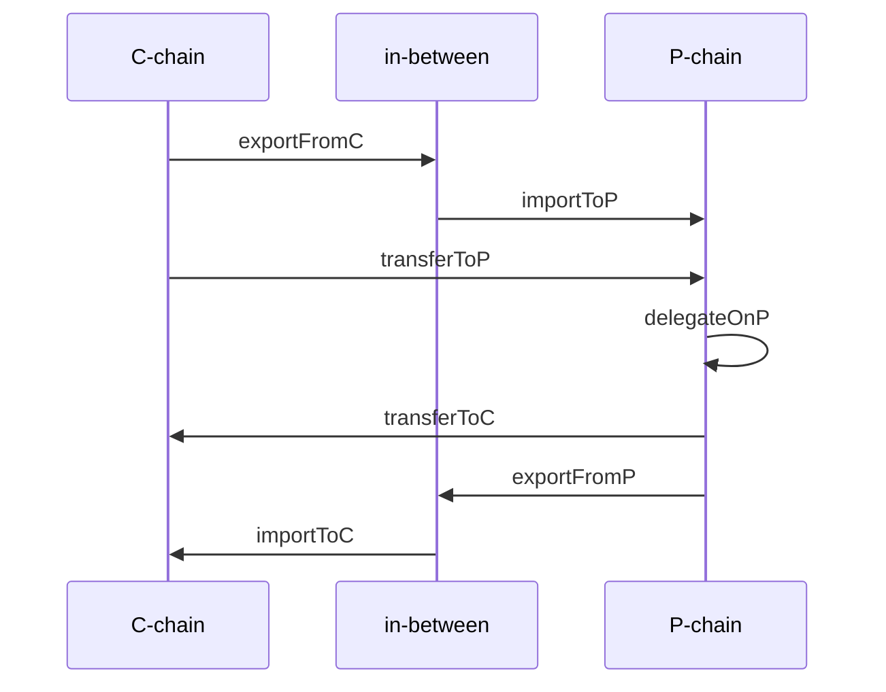

# flare-tx-sdk

This is the official Node.js Software Development Kit (SDK) for performing common actions on the Flare networks:

- [Retrieving account and balance information](#account-and-balance-1)
- [Transferring native and wrapped coins](#coin-transfers-1)
- [Delegating to FTSO providers](#delegation-to-ftso-providers-1)
- [Interacting with the C-chain contracts](#c-chain-contracts-1)
- [Staking on the P-chain](#staking-1)

The SDK is designed to simplify blockchain interactions and offer future-proof support for the above described actions, making it easier to develop apps on the [Flare networks](#network-object). It can be integrated with both [standard and custom wallets](#wallet-implementation) for transaction signing, and provides detailed, step-by-step [transaction tracking](#transaction-tracking).

## Quick start

To install the library in a Node.js project, run
```
npm install @flarenetworks/flare-tx-sdk
```

The following is a short overview of the available actions. Suppose
- `network` is an object of class [`Network`](src/network/network.ts), e.g. `Network.FLARE`
- `wallet` is an object of a suitable class that [implements](#wallet-implementation) the interface [`Wallet`](src/wallet/index.ts)

### Account and balance

Deriving addresses from the wallet's public key:
```
let publicKey = await wallet.getPublicKey()
let cAddress = network.getCAddress(publicKey)
let pAddress = network.getPAddress(publicKey)
```

Overview of the wallet's balance:
```
let balance = await network.getBalance(publicKey)
```

### Coin transfers

Transferring native and wrapped native coin:
```
await network.transferNative(wallet, Amount.nats(1))
await network.transferWrapped(wallet, Amount.wnats(1))
```

Wrapping and unwrapping:
```
await network.wrapNative(wallet, Amount.nats(1))
await network.unwrapToNative(wallet, Amount.wnats(1))
```

### Delegation to FTSO providers

Delegating:
```
let share = Amount.percentages(50)
await network.delegateToFtso(wallet, address1, share, address2, share)
```

Delegation information:
```
let delegates = await network.getFtsoDelegatesOf(cAddress)
```

### C-chain contracts

Calling contract methods:
```
let result = await network.invokeContractCallOnC(address, abi, method, params)
```

Executing contract methods:
```
await network.invokeContractMethodOnC(wallet, address, abi, method, value, params)
```

### Staking

Delegating on the P-chain:
```
await network.delegateOnP(wallet, amount, nodeId, startTime, endTime)
```

Transferring funds back to the C-chain when the delegation ends:
```
await network.transferToC(wallet)
```

## Wallet implementation

In order to generate and sign transactions on the C-chain and P-chain, a suitable implementation of the interface [`Wallet`](src/wallet/index.ts) must be provided. Each object implementing the interface should be associated with a unique signing key.

In general, for transaction generation, the wallet should implement the function
```
getPublicKey(): Promise<string>
```
that returns the public key of the wallet in the hexadecimal encoding. This function is required for P-chain related operations. For generating C-chain transaction only, it is sufficient that the wallet implements the function
```
getCAddress(): Promise<string>
```
that returns the C-chain address in the hexadecimal encoding. This function is not required if the function `getPublicKey` is available.

Moreover, in order to execute transactions, the wallet should implement one or more functions for signing. The documentation of each SDK function that receives the `Wallet` object provides information which of the following functions are suitable to execute the actions.

The functions that can be used for signing are the following.

- The function for signing a C-chain (EVM) transaction (recommended for C-chain related operations):
    ```
    signCTransaction(tx: string): Promise<string>
    ```
    The input `tx` is a hex encoded EIP 1559 (type 2) EVM transaction.

- The function for signing a P-chain transaction (recommended for P-chain related operations):
    ```
    signPTransaction(tx: string): Promise<string>
    ```
    The input `tx` is a hex encoded P-chain transaction.

- The function for signing the digest of a message (generally applicable):
    ```
    signDigest(digest: string): Promise<string>
    ```
    The input `digest` is a hex encoded digest of a hash function.

- The function for signing a message with ETH prefix (applicable for P-chain operations):
    ```
    signEthMessage(message: string): Promise<string>
    ```
    The input `message` is a UTF8 string.

Each of the above functions should return the signature in hexadecimal encoding.

Alternatively, for C-chain related operations, when signing and submitting of a C-chain (EVM) transaction are inseparable, the wallet can implement the function
```
signAndSubmitCTransaction(tx: string): Promise<string>
```
The input `tx` is a hex encoded EIP 1559 (type 2) EVM transaction. If the wallet implements this function, it is considered as the default function for signing C-chain transactions. The function should return the transaction id in hexadecimal encoding.

## Network object

The queries and actions on the network are executed using the [`Network`](src/network/index.ts) object.
- The Flare network:
    ```
    let network = Network.FLARE
    ```
- The Songbird network:
    ```
    let network = Network.SONGBIRD
    ```
- The Coston network (test network for Songbird):
    ```
    let network = Network.COSTON
    ```
- The Coston2 network (test network for Flare):
    ```
    let network = Network.COSTON2
    ```
- For a custom network or a `Network` object with custom settings, first create a suitable [`Constants`](src/network/constants.ts) object `constants` and then use:
    ```
    let network = new Network(constants)
    ```

## Transaction tracking

To track the process of signing and submitting of transactions to the network, the following [callbacks](src/network/callback.ts) can be registered with a `Network` object.

The first three callbacks return a `boolean` and can be used to stop the transaction execution, e.g. if the tool is used only for transaction generation for offline signing. Note, however, that certain processes consist of several consecutive transactions that may depend on each other, and stopping a transaction may result in the failure of subsequent actions.

### Before transaction signature

If set, the function of type `BeforeTxSignatureCallback` is called prior to each signature request on the wallet object. To set the callback, use
```
network.setBeforeTxSignatureCallback(async (data: BeforeTxSignature) => { return true })
```
The object of type `BeforeTxSignature` contains the properties:
- `txType` the [code](src/network/txtype.ts) of the transaction type;
- `unsignedTxHex` the unsigned transaction in the hexadecimal encoding.

The property `unsignedTxHex` can be used for transaction verification (see e.g. [Flare: Transaction verification library](https://github.com/flare-foundation/flare-tx-verifier-lib)).

Normally, the callback should return `true`, which grants the permission to invoke the signature request on the wallet object. If it returns `false`, the transaction is not signed and submitted to the network.

### Before transaction submission

If set, the function of type `BeforeTxSubmissionCallback` is called prior to the submission of each transaction. To set the callback, use
```
network.setBeforeTxSubmissionCallback(async (data: BeforeTxSubmission) => { return true })
```
The object of type `BeforeTxSubmission` contains the properties:
- `txType` the [code](src/network/txtype.ts) of the transaction type;
- `signedTxHex` the signed transaction in the hexadecimal encoding;
- `txId` the id of the signed transaction in the hexadecimal encoding.

Normally, the callback should return `true`, which grants the permission to submit the transaction to the network. If it returns `false`, the transaction is not submitted.

When the function `signAndSubmitCTransaction` is used as the wallet's signing function, this callback is not executed.

### After transaction submission

If set, the function of type `AfterTxSubmissionCallback` is called immediately after the submission of each transaction to the network. To set the callback, use
```
network.setAfterTxSubmissionCallback(async (data: AfterTxSubmission) => { return true })
```
The object of type `AfterTxSubmission` contains the properties:
- `txType` the [code](src/network/txtype.ts) of the transaction type;
- `txId` the id of the sumitted transaction in the hexadecimal encoding.

Normally, the callback should return `true`, which signals that the confirmation of the transaction on the network is to be awaited before proceeding. If it returns `false`, the confirmation is not awaited.

### After transaction confirmation

If set, the function of type `AfterTxConfirmationCallback` is called immediately after the confirmation of each transaction to the network. To set the callback, use
```
network.setAfterTxConfirmationCallback(async (data: AfterTxConfirmation) => { // use data })
```
The object of type `AfterTxConfirmation` contains the properties:
- `txType` the [code](src/network/txtype.ts) of the transaction type;
- `txId` the id of the sumitted transaction in the hexadecimal encoding;
- `txStatus` the status of the transaction: true if accepted and false if rejected.

## Background

### Account and balance

The network uses two different chains for performing operations. Most of the operations are executed on the standard EVM chain, which is called the C-chain (contract chain). The chain for staking is called the P-chain.

The address of a given wallet on the C-chain differs from the address of the same wallet on the P-chain, but both addresses are derived from the same public key. Therefore, the wallet implementation must enable public key retrieval, from which the associated C-chain and P-chain addresses are derived. For a given `wallet`, they can be obtained by
```
let publicKey = await wallet.getPublicKey()
let cAddress = network.getCAddress(publicKey)
let pAddress = network.getPAddress(publicKey)
```

The information on wallet balance can be obtained by
```
let balance = await network.getBalance(publicKey)
```
The resulting object `balance` is of type [`Balance`](src/network/balance.ts) and has the following properties:
- `availableOnC` The balance available on the C-chain;
- `availableOnP` The balance available on the P-chain;
- `wrappedOnC` The balance wrapped on the C-chain
- `stakedOnP` The balance staked on the P-chain;
- `notImportedToC` The balance exported from the P-chain but not imported to the C-chain;
- `notImportedToP` The balance exported from the C-chain but not imported to the P-chain.

Here and herafter, all monetary amounts are considered in the wei units and represented as `bigint`.

Separately, the balance information can be obtained by
```
await network.getBalanceOnC(publicKeyOrCAddress)
```
```
await network.getBalanceWrappedOnC(publicKeyOrCAddress)
```
```
await network.getBalanceOnP(publicKey)
```
```
await network.getBalanceNotImportedToC(publicKey)
```
```
await network.getBalanceNotImportedToP(publicKey)
```
```
await network.getBalanceStakedOnP(publicKey)
```

### Coin transfers

The native coin of the C-chain can be transferred using
```
await network.transferNative(wallet, amount)
```
To transfer the entire native coin balance, use
```
await network.transferAllNative(wallet)
```

The native coin on the C-chain can be wrapped to an ERC20 token WNat, which represents the wrapped native token. The exchange is in ratio 1:1 and can be performed by
```
await network.wrapNative(wallet, amount)
```

The wrapped coin can be ecxhanged back to the native coin by
```
await network.unwrapToNative(wallet, amount)
```

The wrapped coin can be transferred by the ERC20 standard using
```
await network.transferWrapped(wallet, amount)
```

### Delegation to FTSO providers

The account's vote power corresponding to the balance of the wrapped tokens can be delegated to one or two FTSO providers to earn delegation reward. The amount of delegated vote power is specified in percentages. The vote power can be delegated to one or two FTSO providers.

The status of current delegations can be obtained by
```
let delegations = await network.getFtsoDelegatesOf(publicKey)
```
The result is an array of objects of type [`FtsoDelegate`](src/network/balance.ts) with properties:
- `address` The C-chain address of the delegate;
- `shareBP` The delegation share in base points.

The shares are expressed in the base point units, a unit corresponds to 0.01%.

To delegate vote power to one provider, use
```
await network.delegateToFtso(wallet, providerAddress, shareBP)
```
To delegate vote power to two providers, use
```
await network.delegateToFtso(wallet, provider1Address, share1BP, provider2Address, share2BP)
```
The sum of `share1BP` and `share2BP` should be less than 10000, i.e., 100%.

To undelegate all vote power, use
```
await network.undelegateFromFtso(wallet)
```

### C-chain contracts

The C-chain is a standard EVM blockchain populated by the official Flare networks contracts, as well as other contracts deployed by community. To interect with any of these contracts, it is sufficient to know the contract `address` and its application binary interface `abi`.

To call a contract method with the name `method` with the purpose of obtaining information from the contract, use
```
let result = await network.invokeContractCallOnC(address, abi, method, params)
```
where `params` is a sequence of parameters that the method accepts as inputs.

Similarly, to invoke a transaction method, use
```
await network.invokeContractMethodOnC(wallet, address, abi, method, value, params)
```
where `value` is the amount of native tokens to send in transaction when the calling method is marked as `payable`.

For the official Flare networks contracts, the input `address` can be replaced by the contract's name. The list of these contracts is returned by
```
await network.getFlareContracts()
```

### Staking

For staking, the network uses the P-chain and the information about stakes is then automatically mirrored to the C-chain.

In order to stake funds, one must delegate funds to a validator on the P-chain. This means that first a suitable amount of funds must be transferred from one's address on the C-chain to the one's address on the P-chain. After the delegation is complete, one can transfer the funds back from the P-chain to the C-chain.



#### Transferring funds from the C-chain to the P-chain

The process of transferring funds from the C-chain to the P-chain consists of two transactions: export from the C-chain and import to the P-chain. The call
```
await network.transferToP(wallet, amount)
```
first generates an export transaction that exports `amount + importFeeOnP` from the C-chain address and spends a certain `exportFeeOnC`. After the export transaction is signed, submitted and confirmed, an import transaction is generated that imports `amount` to the P-chain address and spends `importFeeOnP`. After the import transaction is signed, submitted and confirmed, the call is complete. The balance on the C-chain address is reduced by `amount + exportFeeOnC + importFeeOnP` and the balance on the P-chain address is increased by `amount`.

Note that the values appearing in the export and import transactions invoked by `transferToP` may differ from the described above if a certain `valueNotImportedToP` had previously not been imported to the P-chain due to the import transaction failure. The export transaction then exports `amount + importFeeOnP - valueNotImportedToP` from the C-chain address or is skipped if this export value is not positive. The import transaction imports `max(amount, valueNotImportedToP)` to the P-chain address and the balance of funds not imported to the P-chain becomes zero.

The value of `exportFeeOnC` is computed as the product of the `baseTxFeeOnC` and the size of the export transaction. The current value of the `baseTxFeeOnC` can be obtained by calling `await network.getBaseTxFeeOnC()`. The value of `importFeeOnP` is fixed and can be obtained by calling `network.getDefaultTxFeeOnP()`.

The export and import can be executed by individual calls as well, in order to have a separate call for each transaction. To export `amount` from the C-chain, use
```
await network.exportFromC(wallet, amount, baseTxFeeOnC)
```
The parameter `baseFeeTxOnC` is optional and can be used to override the automatically acquired base transaction fee from the C-chain. To import all exported funds from the C-chain to the P-chain, use
```
await network.importToP(wallet)
```

#### Delegation on the P-chain

The delegation on the P-chain can be executed by
```
await network.delegateOnP(wallet, amount, nodeId, startTime, endTime)
```
where `amount` is the amount to delegate, `nodeId` is the validator code of the form `NodeID-...`, and `startTime` and `endTime` are times given by the number of seconds from the Unix epoch. A delegation transaction is invoked. After the transaction is signed, submitted and confirmed, the balance on the P-chain address is reduced by `amount` and the staked balance on P is increased by `amount`. The transaction is without fee. After the delegation is complete, the staked amount is returned to the P-chain address.

If the provided `amount` is greater than `availableOnP` at the time of the call, the function attempts to transfer `amount - availableOnP` from the C-chain to the P-chain. Therefore, in such cases, the above call also invokes the export and import transactions as described in the previous section.

#### Transferring funds from the P-chain to the C-chain

The process of transferring funds from the P-chain to the C-chain consists of two transactions: export from the P-chain and import to the C-chain. The call
```
await network.transferToC(wallet, amount)
```
first generates an export transaction that exports `amount` from the P-chain address and spends a fixed `exportFeeOnP`. After the export transaction is signed, submitted and confirmed, an import transaction is generated that imports `amount - importFeeOnC` to the C-chain address and spends a certain `importFeeOnC`. After the import transaction is signed, submitted and confirmed, the call is complete. The balance on the P-chain address is reduced by `amount + exportFeeOnP` and the balance on the C-chain address is increased by `amount - importFeeOnC`. In that sense the function `transferToC` is not symmetric to the function `transferToP` as the `importFee` is difficult to predict in advance.

As a shorthand to transfer the entire balance from the P-chain address to the C-chain address, the `amount` parameter in the above call can be omitted, i.e., the call
```
await network.transferToC(wallet)
```
is equivalent to the above with `amount = balanceOnP - exportFeeOnP`.

Note that the values appearing in the export and import transactions invoked by `transferToC` may differ from the described above if a certain `valueNotImportedToC` had previously not been imported to the C-chain due to the import transaction failure. The export transaction then exports `amount - valueNotImportedToC` from the P-chain address or is skipped if this export value is not positive. The import transaction imports `max(amount, valueNotImportedToC) - exportFeeOnP` to the P-chain address and the balance of funds not imported to the P-chain becomes zero.

The value of `exportFeeOnP` is fixed and can be obtained by calling `network.getDefaultTxFeeOnP()`. The value of `importFeeOnC` is computed as the product of the `baseTxFeeOnC` and the size of the export transaction. The current value of the `baseTxFeeOnC` can be obtained by calling `await network.getBaseTxFeeOnC()`.

The export and import can be executed by individual calls as well, in order to have a separate call for each transaction. To export `amount` from the P-chain, use
```
await network.exportFromP(wallet, amount)
```
To import all exported funds from the P-chain to the C-chain, use
```
await network.importToP(wallet, baseTxFeeOnC)
```
The parameter `baseFeeTxOnC` is optional and can be used to override the automatically acquired base transaction fee from the C-chain.